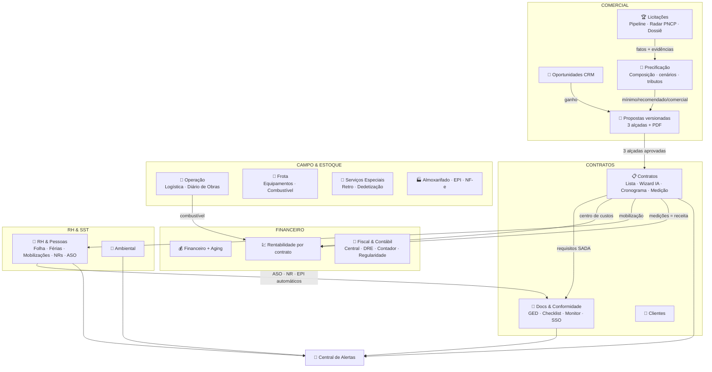
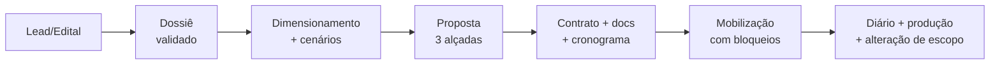
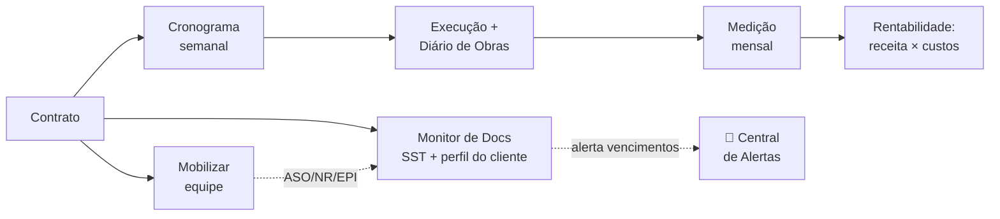

# 🗺️ Mapa do Sistema — Verdelimp ERP

> Gerado no pente-fino de consolidação. Números: **58 páginas de dashboard · 102 rotas de API · 70 modelos de dados**.
> Stack: Next.js 14 (App Router) · PostgreSQL 16 + Prisma · NextAuth (JWT, 8 papéis × 44 permissões) · GROQ IA · Docker na VPS Contabo (porta interna configurável, padrão 3010/3011).

## Visão geral dos domínios

## Fluxo principal (do lead ao lucro)

<!-- Fluxo legado detalhado preservado abaixo para referência operacional. -->

## Hubs de navegação (menu consolidado — 24 entradas)

| Hub (menu) | Abas (URLs preservadas) |
|---|---|
| 🚨 Central de Alertas | Alertas · WhatsApp |
| 🏆 Licitações | Pipeline · Radar PNCP · Dossiê Operacional |
| 🧮 Precificação | Calculadora & BDI · Custo Hora-Homem · Perfis tributários |
| 📋 Contratos | Contratos · Novo Contrato · Cronograma · Medição · Alterações de escopo |
| 🚦 Docs & Conformidade | Arquivos (GED) · Checklist · Monitor · Dossiê SSO · Perfis por cliente |
| 🚛 Operação de Campo | Logística · Diário de Obras |
| 🔧 Frota & Equipamentos | Equipamentos · Combustível |
| 🚜 Serviços Especiais | Retroescavadeira · Dedetização |
| 🏭 Almoxarifado & EPI | Almoxarifado · Controle de EPI · Importar NF-e |
| 💼 Fiscal & Contábil | Central Fiscal · DRE · Relatório Contador · Regularidade |
| 👷 RH & Pessoas | RH & Folha · Folha INSS/IRRF · Férias & Ocorrências · Mobilizações · Treinamentos NR · ASO |

Definição central em `src/lib/nav-grupos.ts`; a barra de abas (`src/components/SubNav.tsx`) é renderizada automaticamente pelo layout quando a rota pertence a um hub.

## Automações entre módulos

- **Dossiê validado e calculado** → proposta versionada com preço mínimo, recomendado e comercial
- **Versão aprovada nas três alçadas** → contrato + matriz documental dinâmica + cronograma + reservas confirmadas, em uma transação (`/api/proposta-contrato`)
- **Mobilização** → bloqueada se faltar documento aprovado com arquivo, houver validade insuficiente ou conflito de recurso; pode ser reavaliada após a correção
- **Diário de obras** → produção e HH reais comparados ao planejamento; desvio pode abrir alteração de escopo
- **ASO / Treinamento NR / entrega de EPI** cadastrados → preenchem automaticamente a matriz do Monitor de Docs (`autoSource`)
- **Combustível lançado com contrato** → entra sozinho na Rentabilidade
- **Tudo que vence** (contrato, ASO, NR, CNH, EPI/CA, licença ambiental, certidão, férias CLT) → agregado na Central de Alertas
- **Medição aprovada/faturada** → receita da Rentabilidade
- **Backup do banco** → cron diário 02h20 na VPS (retenção 14 dias)

## Regras de segurança (imutáveis)

- Fiscal é **apoio gerencial**: sem transmissão oficial SEFAZ/eSocial/NFS-e sem certificado + homologação + contador
- Nunca commitar: `.env.production`, certificados, XMLs reais, documentos de funcionários, contratos reais, chaves de API
- Login obrigatório (middleware em `src/middleware.ts`), papéis/permissões no banco, auditoria de ações críticas
